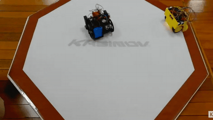
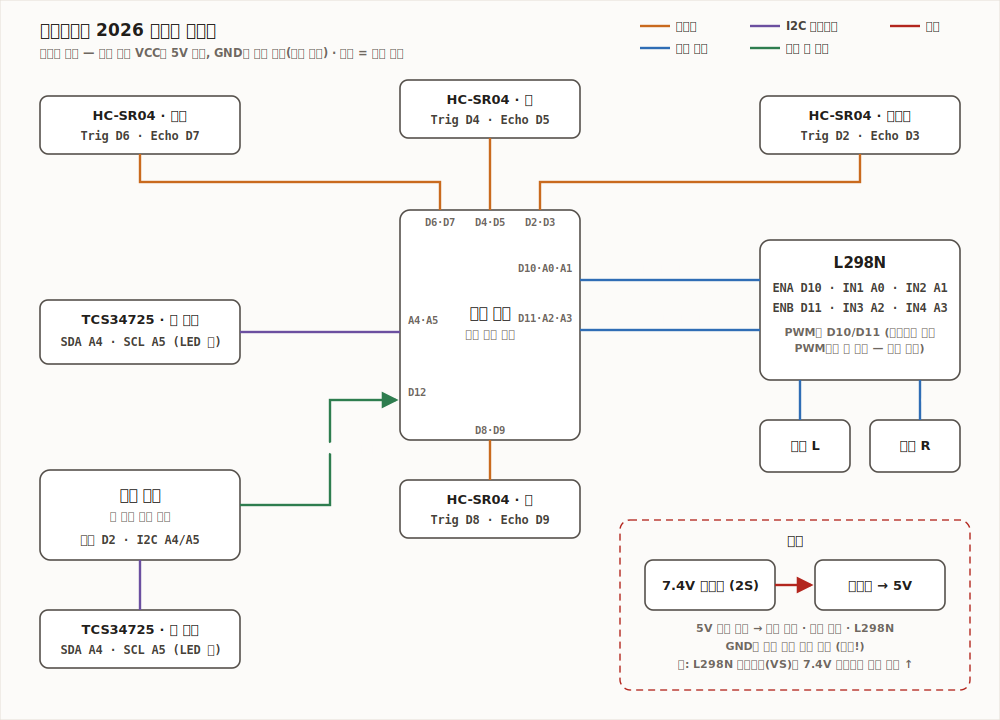

# KAsimov Cup 2026 스모봇 펌웨어

> **📖 팀 가이드 (규칙·하드웨어·전술 상태머신·튜닝):** https://fff-2.github.io/kasimovcup/
> **🎬 경기 영상 (2026-07-10):** https://fff-2.github.io/kasimovcup/#video · [파일](docs/media/match-2026-07-10.mp4)

[](https://fff-2.github.io/kasimovcup/#video)

아두이노 나노 2대 구성. `main_nano/`는 메인(모든 연산), `color_nano/`는 뒤쪽 컬러센서 전담.
라이브러리 설치 불필요 (TCS34725 드라이버 내장, `Wire`만 사용).
**시작 버튼 없음 — 전원 연결 = 시작 신호** (5초 카운트다운 후 자동 기동).

## 배선



### 메인 나노
| 부품 | 핀 |
|---|---|
| 초음파 오른쪽 (HC-SR04) | trig D2 / echo D3 |
| 초음파 앞 | trig D4 / echo D5 |
| 초음파 왼쪽 | trig D6 / echo D7 |
| 초음파 뒤 | trig D8 / echo D9 |
| L298N ENA (왼쪽 모터 PWM) | D10 |
| L298N ENB (오른쪽 모터 PWM) | D11 |
| L298N IN1 / IN2 (왼쪽) | A0 / A1 |
| L298N IN3 / IN4 (오른쪽) | A2 / A3 |
| 앞 TCS34725 | SDA=A4, SCL=A5 |
| 컬러 나노 신호 입력 | D12 |
| 상태 LED | D13 (시작 카운트다운 점멸 · PUSH/라인 감지 표시) |

### 컬러 나노
| 부품 | 핀 |
|---|---|
| 뒤 TCS34725 | SDA=A4, SCL=A5 |
| 감지 신호 출력 | D2 → 메인 나노 D12 |

**전원**: 7.4V(2S) 배터리 → 강압기 5V → 나노 2대 + L298N 병렬 공급.

**공통 주의사항**
- 두 나노는 반드시 **GND를 서로 연결** (신호선이 동작하는 기준)
- TCS34725 모듈의 LED는 항상 켜둘 것 (로봇 밑은 그늘이라 LED 조명 필수)
- 컬러센서 장착 높이는 규정 최소치인 **2cm에 최대한 가깝게** (높을수록 신호 약해짐)
- L298N은 약 2V를 까먹음 → 모터전원(VS)이 5V 레일 경유면 모터 실효 ~3V.
  **VS만 7.4V 직결(로직은 5V 유지)하면 밀기 토크가 크게 상승** — 검토 권장
- **전원 연결 = 시작 신호!** 위치를 다 잡기 전에는 배터리를 연결하지 말 것

## 업로드
Arduino IDE에서 보드 = **Arduino Nano**, 프로세서 = **ATmega328P**.
업로드 실패 시 프로세서를 **ATmega328P (Old Bootloader)** 로 변경 (구형/호환 나노 대부분 해당).

## 경기 절차
1. 로봇을 시작 지점(흰 바닥)에 정확히 배치 — **배터리는 아직 연결하지 않음**
2. **심판 신호에 맞춰 배터리 연결 = 시작 신호**
3. LED 느린 점멸 5초 대기 (이 사이 컬러 나노가 전원 후 2초에 자동 캘리브레이션)
4. 마지막 1초 빠른 점멸 = 출발 임박 → 메인 나노 캘리브레이션(~0.5초) 후 자동 기동

## 현장 튜닝 (main_nano.ino 상단 상수)
| 상수 | 기본값 | 조정법 |
|---|---|---|
| `TURN_45_MS` | 350 | 시작 회전이 45°가 되게. **살짝 덜 돌게** 하는 쪽이 안전 (배터리 닳으면 회전량 감소) |
| `CIRCLE_DIR` | 1 | 선회 방향 반전은 -1 |
| `AUTO_START_MS` | 5000 | 전원 인가 후 자동 시작 대기. 컬러 나노 캘리브(2초)보다 커야 함 — **3000 미만 금지** |
| `LINE_CLEAR_FRAC` / `RED_RATIO_DELTA` | 0.45 / 0.10 | DEBUG=1로 흰 바닥과 빨간 선 위에서 c(clear)값·감지 여부 확인 후 조정 |
| `ATTACK_DIST_CM` | 30 | 상대 로봇을 실제로 세워두고 감지 거리 확인 |
| `MOTOR_L_INVERT` / `MOTOR_R_INVERT` | 0 | 바퀴가 반대로 돌면 1 |
| 게인 (tcsInit 안 `0x02`) | 16x | DEBUG에서 흰 바닥 clear < 2000이면 `0x03`(60x)으로 |

**경기 업로드 전 두 스케치 모두 `DEBUG 0` 확인!** (시리얼 출력이 루프를 느리게 함)

## 동작 개요 (상태머신)
```
전원 연결 → 5초 카운트다운(LED 점멸) → 캘리브레이션 → 45° 회전 → 직진 → 라인 도달
  → [라인 추종] 경계선 따라 위빙 선회
      ├─ 앞 초음파 30cm: 안쪽으로 150ms 선회(비스듬한 각) → 전속 밀기 → 장외 유도
      ├─ 뒤 초음파 25cm: 가속 + 안쪽 파고들기 (상대가 바깥으로 오버슛하면 측면 밀기)
      └─ 8초 무접촉: 90° 안쪽 회전 후 중앙 가로지르기 (같은 방향 선회 교착 해소)
안전 규칙 (항상 우선):
  - 앞 라인 감지 = 즉시 회피 (밀기 중에도) — 자기 장외 방지
  - 앞뒤 동시 감지 = 제자리 회전으로 복귀
  - 1.5초 정지 = 강제 재기동 (행동불능 감점 방지)
```
